<div align="center">

<!-- HEADER CON ANIMACIÓN DE TYPING -->


<!-- TÍTULO PRINCIPAL CON ESTILO -->
<h1>
  
</h1>

<!-- BADGES SOCIALES MODERNOS -->
<p>
  <a href="https://github.com/tu-usuario">
    
  </a>
  <a href="https://linkedin.com/in/tu-usuario">
    
  </a>
  <a href="mailto:tu-email@gmail.com">
    
  </a>
  <a href="https://twitter.com/tu-usuario">
    
  </a>
</p>

<!-- CONTADOR DE VISITAS ESTILIZADO -->


</div>

<br/>

<!-- SECCIÓN SOBRE MÍ CON DISEÑO MODERNO -->
<div align="center">
  
## 🎯 About Me

</div>


```typescript
const developer = {
    name: "Sergio Andres Barrientos Ochoa",
    role: "Full Stack Developer",
    location: "🌎 Temuco, Chile",
    code: ["Python", "C#"],
    technologies: {
        frontend: ["React", "Next.js", "Vue", "Tailwind"],
        backend: ["Node.js", "Django", "FastAPI"],
        databases: ["PostgreSQL", "MongoDB", "Redis"],
        tools: ["Docker", "Git", "AWS", "Vercel"]
    },
    currentFocus: "Building awesome things with AI 🤖",
    funFact: "I debug with console.log() 🐛"
};
```

<br clear="right"/>

<!-- SEPARADOR CON LÍNEA DE GRADIENTE -->


<!-- ESTADÍSTICAS EN DISEÑO DE TARJETAS -->
<div align="center">

## 📊 GitHub Analytics

<details open>
<summary><b>📈 Click to expand stats</b></summary>
<br>

<!-- GITHUB STATS CARDS CON TEMA PERSONALIZADO -->
<p align="center">
  
  
</p>

</details>

</div>

<!-- MÉTRICAS PERSONALIZADAS GENERADAS -->
<div align="center">

## 🎨 Profile Highlights

<!-- HEADER METRICS -->


<!-- GRID DE MÉTRICAS 2x2 -->
<table>
  <tr>
    <td width="50%" align="center">
      
    </td>
    <td width="50%" align="center">
      
    </td>
  </tr>
  <tr>
    <td width="50%" align="center">
      
    </td>
    <td width="50%" align="center">
      
    </td>
  </tr>
</table>

</div>

<!-- SEPARADOR -->


<!-- ACTIVIDAD RECIENTE CON DISEÑO EXPANDIBLE -->
<div align="center">

## 🔥 Recent Activity & Contributions

<details open>
<summary><b>⚡ Activity Feed</b></summary>
<br>

</details>

<details>
<summary><b>📅 Contribution Calendar</b></summary>
<br>

</details>

<details>
<summary><b>📝 Code Statistics</b></summary>
<br>

</details>

</div>

<!-- SEPARADOR -->


<!-- SECCIÓN DE TECNOLOGÍAS CON ICONOS ANIMADOS -->
<div align="center">

## 🛠️ Tech Stack

### Languages
<p>
  
  
  
  
  
</p>

### Frontend
<p>
  
  
  
  
  
</p>

### Backend & Databases
<p>
  
  
  
  
  
  
</p>

### DevOps & Tools
<p>
  
  
  
  
  
</p>

</div>

<!-- SEPARADOR -->


<!-- SECCIÓN DE LOGROS Y ESTADÍSTICAS AVANZADAS -->
<div align="center">

## 🏆 Achievements & Stats

<table>
  <tr>
    <td width="50%">
      
    </td>
    <td width="50%">
      
    </td>
  </tr>
  <tr>
    <td width="50%">
      
    </td>
    <td width="50%">
      
    </td>
  </tr>
</table>

</div>

<!-- SEPARADOR -->


<!-- PROYECTOS Y CÓDIGO -->
<div align="center">

## 💼 Projects & Code

<details>
<summary><b>🚀 Featured Projects</b></summary>
<br>

</details>

<details>
<summary><b>💾 Code Snippets</b></summary>
<br>
<table>
  <tr>
    <td width="50%">
      
    </td>
    <td width="50%">
      
    </td>
  </tr>
</table>
</details>

<details>
<summary><b>⭐ Star History</b></summary>
<br>

</details>

</div>

<!-- SEPARADOR -->


<!-- COMUNIDAD Y TÓPICOS -->
<div align="center">

## 🌐 Community & Interests

<table>
  <tr>
    <td width="50%" align="center">
      <h3>📌 Topics of Interest</h3>
      
    </td>
    <td width="50%" align="center">
      <h3>👥 Community</h3>
      
    </td>
  </tr>
</table>

<details>
<summary><b>💬 Discussions</b></summary>
<br>

</details>

</div>

<!-- SEPARADOR -->


<!-- GRÁFICO DE CONTRIBUCIONES SNAKE GAME -->
<div align="center">

## 🐍 Contribution Graph

<picture>
  <source media="(prefers-color-scheme: dark)" srcset="https://raw.githubusercontent.com/tu-usuario/tu-usuario/output/github-contribution-grid-snake-dark.svg">
  <source media="(prefers-color-scheme: light)" srcset="https://raw.githubusercontent.com/tu-usuario/tu-usuario/output/github-contribution-grid-snake.svg">
  
</picture>

</div>

<!-- SEPARADOR -->


<!-- EXTRAS Y DIVERSIÓN -->
<div align="center">

## 🎲 Just for Fun

<details>
<summary><b>🎯 Random Dev Quote</b></summary>
<br>

</details>

<details>
<summary><b>😂 Random Dev Joke</b></summary>
<br>

</details>

<details>
<summary><b>🔮 Fortune Cookie</b></summary>
<br>

</details>

</div>

<!-- SEPARADOR -->


<!-- SECCIÓN DE TROFEOS DE GITHUB -->
<div align="center">

## 🏅 GitHub Trophies


</div>

<!-- SEPARADOR -->


<!-- CITAS Y MÚSICA (OPCIONALES) -->
<div align="center">

## 💭 Current Vibes

<!-- Spotify (si tienes) - reemplaza con tu ID -->
<!-- [](https://open.spotify.com/user/tu-spotify-id) -->

### 💡 Quote of the Day

> "The best way to predict the future is to invent it."  
> — Alan Kay

</div>

<!-- SEPARADOR -->


<!-- CONTACT SECTION CON ESTILO -->
<div align="center">

## 📬 Let's Connect!

<p>
  <a href="https://github.com/tu-usuario">
    
  </a>
  <a href="https://linkedin.com/in/tu-usuario">
    
  </a>
  <a href="mailto:tu-email@gmail.com">
    
  </a>
  <a href="https://twitter.com/tu-usuario">
    
  </a>
  <a href="https://discord.gg/tu-server">
    
  </a>
  <a href="https://tu-portfolio.com">
    
  </a>
</p>

### 💌 Open for collaborations, freelance work, and interesting conversations!

</div>

<!-- FOOTER CON WAVE -->


<!-- FOOTER TEXT -->
<div align="center">

### ⭐️ From [tu-usuario](https://github.com/tu-usuario) with 💙

<p>
  
  
  
</p>

*Last auto-updated: by GitHub Actions ⚡*

</div>
